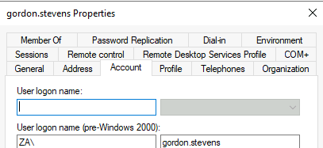

# Enumerating Active Directory

## Concepts
-Active Directory (AD)
-Bloodhound
-AD RSAT
-runas.exe

Credentials (from http://distributor.za.tryhackme.com/creds)
Username: graeme.williams 
Password: hJnlKuLBa2 ---> Tramposo.123

### Useful commands (cmd)
`net user /domain`				#To enumerate users in the joined domain  

`net user <NAME> /domain`		#To enumerate the groups the user is member of  

`net group /domain`				#To enumerate the available groups in the domain  

`net group <NAME> /domain`		#To enumerate the members of a specific group \<NAME\>  

`net accounts /domain`			#To list password policies  

[Documentation ](https://docs.microsoft.com/en-us/troubleshoot/windows-server/networking/net-commands-on-operating-systems)

### More useful commands (PowerShell)

`Get-ADUser -Identity gordon.stevens -Server za.tryhackme.com -Properties *` 	# To query AD users by their logon name   

`Get-ADGroup -Identity Administrators -Server za.tryhackme.com`					# To get group information

`Get-ADGroupMember -Identity Administrators -Server za.tryhackme.com`			# To get the members of a group

`$ChangeDate = New-Object DateTime(2022, 02, 28, 12, 00, 00)`					# Define an objet type datetime with a specific value

`Get-ADObject -Filter 'whenChanged -gt $ChangeDate' -includeDeletedObjects -Server za.tryhackme.com`	# Query objects that have been modified since $ChangeDate

`Get-ADObject -Filter 'badPwdCount -gt 0' -Server za.tryhackme.com`				# Display users that have tried to log in and failed at least 1 time

`Set-ADAccountPassword -Identity graeme.williams  -Server za.tryhackme.com -OldPassword (ConvertTo-SecureString -AsPlaintext "hJnlKuLBa2" -force) -NewPassword (ConvertTo-SecureString -AsPlainText "Tramposo.123" -Force)` # Change password

`Get-ADObject -Filter 'ObjectClass -eq "group"' -Properties whencreated | Select-Object name, whencreated | sort name | ft -AutoSize` # Find an object with a specific property

scp graeme.williams@THMJMP1.za.tryhackme.com:C:/Users/graeme.williams/Documents/20220616032307_BloodHound.zip .
